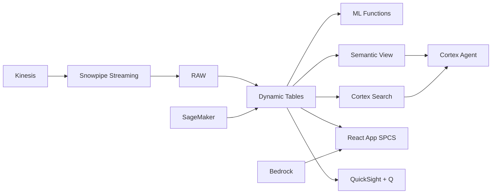

# Social Commerce Analytics & Influencer Intelligence

Filipinos spend 4+ hours daily on social media — Snowflake analyzes social commerce sentiment with AI, extracts product mentions, scores influencer ROI, and drives personalized recommendations via Cortex Complete.

## Architecture

Filipinos are the world's most active social media users — 4.1 hours per day across Facebook, TikTok, Instagram, and YouTube. Social commerce in the Philippines hit ₱280B in 2023. A leading retail brand partners with 2,800 influencers but can't tell which ones drive actual purchases vs. just engagement. Snowflake connects social sentiment and content analysis directly to commerce outcomes.



## Snowflake Capabilities

| Capability | Implementation |
|-----------|---------------|
| Dynamic Tables | INFLUENCER_ROI / TRENDING_PRODUCTS / CONTENT_PERFORMANCE / AUDIENCE_AFFINITY |
| ML Functions | ML.CLASSIFICATION + ML.FORECAST |
| Cortex AI | AI_SENTIMENT, AI_EXTRACT, COMPLETE |
| Cortex Search | 1200000 documents indexed |
| Cortex Agent | SOCIAL_COMMERCE_AGENT |
| Semantic View | SOCIAL_COMMERCE_ANALYTICS |
| React App (SPCS) | 5 tabs + DemoGuide |


## AWS Services

| Service | Role in Demo |
|---------|-------------|
| Amazon Comprehend | Sentiment analysis and entity extraction from social posts |
| Amazon Personalize | Product recommendations based on user behavior |
| Amazon Kinesis | Stream social media events in real-time |
| Amazon Bedrock (Claude) | Generate content recommendations and campaign briefs |
| Amazon QuickSight + Q | Social commerce analytics dashboard |
| Amazon SageMaker | Conversion prediction model |


## Personas

| Persona | Role | Key Questions |
|---------|------|---------------|
| **Samantha Kaye Ong** | Head of Digital Commerce | "Which influencer campaigns had the highest ROI this month?" "What products are trending on TikTok Shop?" |
| **Patrick Bryan Mendoza** | Social Commerce Analyst | "Which content format drives the most purchases?" "What's the sentiment around our brand mentions this week?" |


## Data

| Table | Rows | Description |
|-------|------|-------------|
| INFLUENCERS | 2,800 | Influencer profiles (nano to mega) with metrics |
| SOCIAL_POSTS | 1,200,000 | Social media posts mentioning brand/products |
| CAMPAIGN_EVENTS | 45,000 | Influencer campaign events with spend and attribution |
| SOCIAL_ORDERS | 680,000 | Orders attributed to social commerce channels |
| PRODUCT_CATALOG | 15,000 | Product catalog with categories and margins |
| AUDIENCE_SEGMENTS | 1,500,000 | Audience profiles from social platform pixels |


## Build Instructions

### Prerequisites
- Snowflake account with ACCOUNTADMIN access
- Cortex AI enabled (ML Functions, Search, Agent)
- Warehouse: SOCIAL_WH (Medium)
- AWS CLI with access (us-west-2)

### Deployment

```bash
snowsql -f snowflake/00_setup.sql
snowsql -f snowflake/01_marketplace_install.sql
snowsql -f snowflake/02_raw_tables.sql
snowsql -f snowflake/03_staging.sql
snowsql -f snowflake/04_dynamic_tables.sql
snowsql -f snowflake/05_search.sql
snowsql -f snowflake/06_ml_models.sql
snowsql -f snowflake/07_semantic_view.sql
snowsql -f snowflake/08_agent.sql
```

### React App (SPCS)
```bash
cd app && npm ci && npm run build
docker build -t aws-philippines-retail-social-commerce-app .
docker push bdiqc8sm-default.registry.snowflakecomputing.com/social_commerce/app/aws_philippines_retail_social_commerce/app:latest
```

### Demo Mode
Open the app URL with `?demo=true` for presenter view.

## Build Modes

### Snowflake Only
Run scripts 00-08 (skip AWS-specific integration). Uses:
- **AI_SENTIMENT + AI_EXTRACT (native)** instead of Amazon Comprehend
- **Cortex Complete + ML.CLASSIFICATION** instead of Amazon Personalize
- **Snowpipe Streaming SDK** instead of Amazon Kinesis
- **Cortex Complete** instead of Amazon Bedrock (Claude)
- **Snowflake Intelligence (Cortex Analyst)** instead of Amazon QuickSight + Q
- **ML.CLASSIFICATION (native)** instead of Amazon SageMaker

### Full AWS + Snowflake
Run all scripts including AWS integration. Deploy QuickSight dashboard from `quicksight/`.

## Business Impact

Industry research and Snowflake customer outcomes:
- **Philippines has world's highest social media usage at 4.1 hours/day per user** — [We Are Social / DataReportal](https://datareportal.com/reports/digital-2024-philippines)
- **Philippine social commerce market reached ₱280B in 2023 with 45% growth** — [Google-Temasek SEA](https://www.bain.com/insights/e-conomy-sea-2023/)
- **TikTok Shop Philippines grew 85% in GMV during 2023** — [TikTok for Business](https://www.tiktok.com/business/en-PH)
- **Nano-influencers (1K-10K followers) deliver 2-3x higher engagement than mega-influencers** — [Later/Influencer Marketing Hub](https://influencermarketinghub.com/influencer-marketing-benchmark-report/)
- **Instacart** (Snowflake customer): serves 1.4B+ data points daily on Snowflake for real-time personalization across 80K+ retail locations -- [snowflake.com/customers/instacart](https://www.snowflake.com/en/customers/all-customers/case-study/instacart/)

## Key Demo Numbers

- **₱2.1B** social commerce revenue this quarter
- **2,800** active influencer partnerships
- **1.2M posts** analyzed by AI_SENTIMENT + AI_EXTRACT
- **4.2x ROAS** average for nano-influencer campaigns
- **38%** of social commerce from TikTok Shop
- **3.2x** higher conversion for live selling format


## License

Apache 2.0 — See [LICENSE](LICENSE) for details.

This is a personal demo project and is not an official Snowflake offering. It comes with no support or warranty.